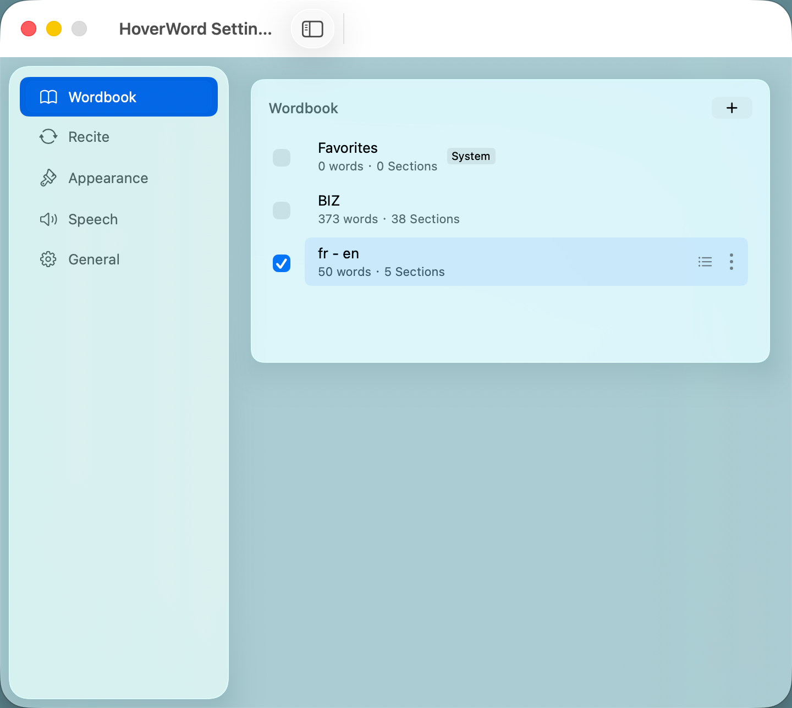
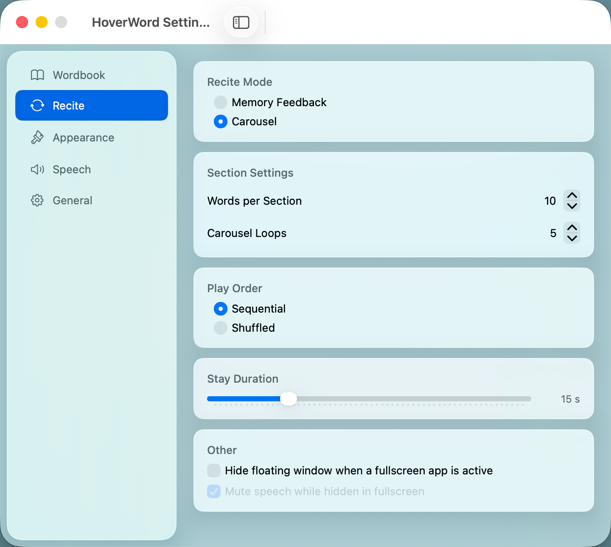
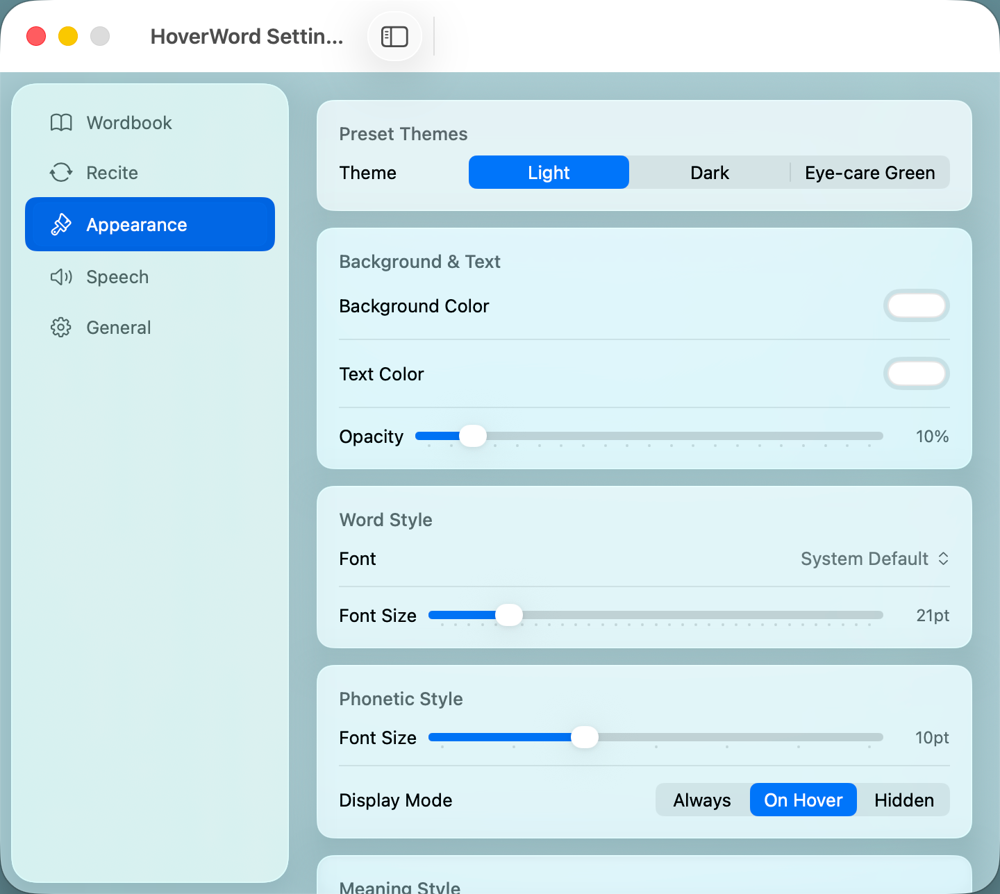
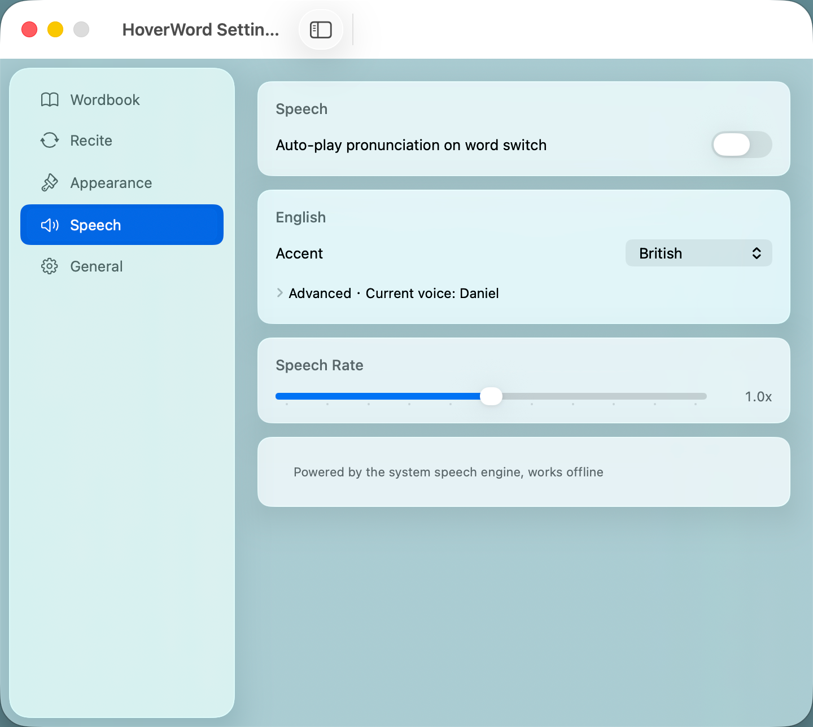
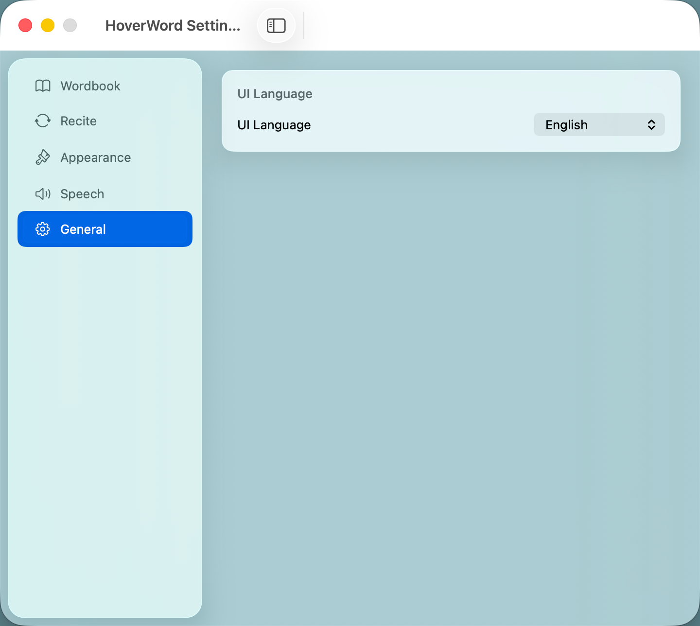

# HoverWord

HoverWord — A lightweight floating word-flashcard app for macOS. It keeps a small, always-on-top window on your desktop, reinforcing vocabulary through high-frequency visual repetition without demanding extra focus time. Wordbooks are language-agnostic by design, supporting vocabulary import across multiple languages, and the app interface itself is available in both English and Chinese.

## Core Features

### Floating Recite Window

- Frameless Liquid Glass window, always-on-top, non-intrusive
- Freely draggable to any screen position, resizable
- Persists position and size across launches
- Multi-display support

### Four-Column Layout

From left to right: **Word | Phonetic | Meaning | Actions**

- Word in bold, phonetic in smaller type below (auto-hidden when unavailable)
- Multiple meaning groups joined by " / ", vertically centered, auto-wrapping
- Action buttons hidden by default, smoothly fade in on hover

### Two Recite Modes

- **Memory Feedback** — Tap "Know" or "Don't Know" after seeing each word; the engine adapts progress based on your feedback
- **Carousel** — Set a dwell interval; words cycle automatically at your chosen pace, hands-free

### Speech

- Automatic word pronunciation with British / American accent toggle
- Powered by macOS system TTS, fully offline, no network required

### Multi-Language Support

HoverWord is designed language-agnostic from the ground up. While the default workflow is English → Chinese, the architecture supports any language pair.

- **Auto Language Detection** — On import, HoverWord analyzes the first 20 entries using `NLLanguageRecognizer` (NaturalLanguage framework, offline) to identify source and target languages. Confidence threshold of 0.7; falls back to defaults (en / zh-Hans) on ambiguity.
- **Manual Language Override** — Each wordbook's `...` menu offers a "Language…" editor to set source/target languages explicitly, covering detection edge cases and existing wordbooks.
- **Speech Partitioning** — The Speech settings page automatically creates one pronunciation panel per enabled language, each with its own accent and voice selection. Panels appear and disappear in real time as wordbooks are enabled, disabled, or re-labeled.
- **Supported Languages** — English, French, Spanish, German, Japanese, Korean, Chinese (Simplified), Italian, Portuguese, Russian. The registry is centralized in `Constants.swift` and extensible without code changes elsewhere.
- **RTL-Ready** — UI layout reserves entry points for right-to-left adaptation when non-LTR languages are added.

### Wordbook Management

- Import UTF-8 TXT wordbooks (Tab-delimited, up to 3 meaning groups per entry)
- Multiple wordbooks can be enabled simultaneously and combined into one recite queue
- Favorites for flagging difficult words, with a dedicated system wordbook for focused review

#### Import Format

TXT files must be **UTF-8** encoded. One entry per line, fields separated by **Tab (`\t`)**, in fixed order:

```
source_word	phonetic	pos1	meaning1	pos2	meaning2	pos3	meaning3
```

- **Required**: source word, meaning 1
- **Optional**: phonetic, pos2/meaning2, pos3/meaning3 (leave blank if absent)
- Blank lines are skipped; format errors report the exact line number

Example:

```
abandon	/əˈbændən/	v.	to give up, to abandon
ambition	/æmˈbʃən/	n.	ambition, aspiration	v.	to desire
```

### Appearance

- Preset themes (Light / Dark / Eye-care Green)
- Fully customizable: background color, text color, opacity, font family and size
- Automatically follows system light/dark mode
- Live floating-window preview inside the Settings window

## Use Cases

- Glance at a new word while coding
- Review a set during a meeting break
- Revisit yesterday's favorites while reading email
- Any "one look, one memory" micro-moment

## System Requirements

- macOS 14.0 (Sonoma) or later
- Intel and Apple Silicon supported
- No third-party dependencies; built entirely with system frameworks

## Screenshots













